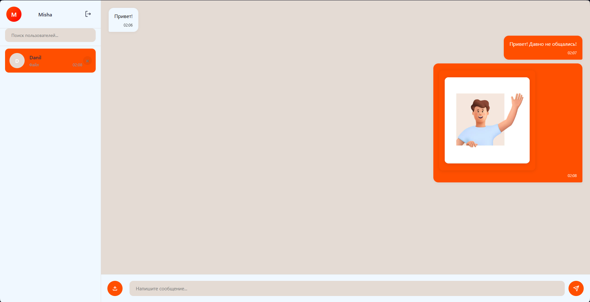

# Realtime Messenger

Fullstack-мессенджер с реалтайм-доставкой сообщений через WebSocket, JWT RS256-аутентификацией в httpOnly-cookie, загрузкой файлов со сжатием изображений и Docker-инфраструктурой.


---

## Результат

Статические проверки чистые: `ruff` — 0 ошибок, `ruff format` — 0, `mypy` — 0.

```text
=== Code Quality Report ===
✅ Ruff (lint)
✅ Ruff (format)
✅ Mypy

Artifacts: backend/reports
```



---

## Как это работает

Пользователь регистрируется и логинится — сервер выдаёт пару JWT (access + refresh) на асимметричном RS256 и кладёт их в httpOnly-cookies. Фронт на vanilla JS + Jinja2 подключается к WebSocket (`/api/ws/{user_id}`) и получает push-уведомления о новых сообщениях и чатах. При отправке сообщения сервер сохраняет его в PostgreSQL и рассылает через `ConnectionManager` всем участникам чата. Файлы загружаются через `multipart/form-data`, изображения сжимаются в WebP (Pillow), при отдаче адаптируются под устройство по User-Agent.

---

## Быстрый старт

```bash
git clone git@github.com:ITouch228/ITMessage.git
cd ITMessage

cp .env.example .env
cp backend/app/.env.example backend/app/.env   # заполнить DB_PASSWORD, DB_NAME

docker compose up --build -d
```

- Приложение — http://localhost:8000
- API docs — http://localhost:8000/docs

> **Важно:** для RS256-токенов нужна RSA-пара в `backend/keys/` (`private.pem` + `public.pem`).
> Директория в `.gitignore` — ключи не коммитятся, каждый разработчик генерирует свою пару локально:
> ```bash
> mkdir -p backend/keys
> openssl genrsa -out backend/keys/private.pem 2048
> openssl rsa -in backend/keys/private.pem -pubout -out backend/keys/public.pem
> ```
> Без ключей приложение упадёт при старте с `FileNotFoundError: .../keys/private.pem`.

Без Docker:

```bash
cd backend
python -m venv .venv && .venv\Scripts\activate
pip install -r requirements.txt
cp app/.env.example app/.env   # заполнить
alembic upgrade head
uvicorn app.main:app --reload
```

---

## Стек

**Backend**
- **Python** 3.12
- **FastAPI** 0.115 + **Starlette** — async-роуты, WebSocket, middleware
- **SQLAlchemy** 2.0 (async) + **asyncpg** — ORM и драйвер PostgreSQL
- **Alembic** — миграции
- **python-jose** — JWT RS256 (access/refresh)
- **passlib + bcrypt** — хеширование паролей
- **Pillow** — сжатие изображений в WebP
- **aiofiles** — async файловый I/O
- **Jinja2** — серверные шаблоны
- **Ruff** (lint + format) + **mypy** (types)

**Frontend**
- **Vanilla JS** (ES Modules) + **Jinja2** — без фреймворка
- **Axios** — HTTP-клиент с auto-refresh интерсептором
- **WebSocket API** — нативный браузерный
- **CSS** — адаптивная вёрстка

**Инфраструктура**
- **Docker** + **docker-compose** — postgres 16 + backend (backend отдаёт приложение напрямую на 8000, без reverse proxy)
- **Makefile** — команды разработки

---

## Архитектура

Слоистая: `routes → services → dao → database`. Роуты не знают про SQL, сервисы не знают про HTTP.

**Backend** (`backend/app/`):
- `routes/` — HTTP-эндпоинты + WebSocket (auth, users, chats, messages, files, ws)
- `services/` — бизнес-логика (auth, chats, files, messages, users, websocket_manager)
- `dao/` — BaseDAO + специфичные DAO (UserDAO, ChatDAO, MessageDAO, FileDAO)
- `models/` — SQLAlchemy-модели
- `schemas/` — Pydantic-схемы (DTO, изоляция от БД)
- `core/` — константы
- `utils/` — логирование, работа с путями файлов
- `static/` — JS, CSS, изображения, звуки
- `templates/` — Jinja2-шаблоны

### Ключевые решения

- **JWT RS256 (асимметричный).** Приватный ключ подписывает на сервере, публичный проверяет. Компрометация публичного ключа не даёт подделать токен — в отличие от HS256.
- **Токены в httpOnly-cookies, не в JS-памяти.** `set_cookie(httponly=True, secure, samesite)` — XSS не украдёт токен. Фронт не хранит access/refresh в `localStorage`.
- **Auto-refresh JWT с очередью запросов.** При 401 интерсептор в `api.js` обновляет токен ровно один раз, параллельные упавшие запросы складываются в `queue` и повторяются после обновления. Отдельный `authApi`-клиент без интерсепторов исключает цикл рефреша.
- **ConnectionManager для WebSocket.** `dict[int, list[WebSocket]]` — один пользователь может иметь несколько вкладок. `send_personal_message` итерирует по всем подключениям пользователя.
- **Валидация пути файла через resolve + startswith.** `save_file` и `resolve_file_path` проверяют, что разрешённый путь начинается с `FILES_ROOT` — защита от path traversal (`../../etc/passwd`).
- **Dummy bcrypt-hash при отсутствии пользователя.** `authenticate_user` вызывает `verify_password` с фейковым хешем, если юзер не найден — время ответа одинаковое, user enumeration по timing невозможен.
- **Изображения: сжатие при загрузке + адаптивная отдача.** При загрузке — WebP quality 85. При отдаче — параметризованный `width`/`quality` с подменой по User-Agent (mobile: 800px/60, desktop: 1200px/80).
- **SSE `/sse-updates` как fallback.** Если WebSocket недоступен, фронт подписывается на Server-Sent Events с поллингом счётчика обновлений чатов.
- **Временный чат (`temp-{userId}`).** При первом сообщении незнакомому пользователю фронт создаёт temp-чат, бэкенд при отправке конвертирует его в реальный и уведомляет получателя через WebSocket.

### Что решалось по ходу

- **Гонка сообщений при отправке.** Без блокировки кнопки можно было отправить два сообщения с одним temp-чатом → два чата с одним получателем. Решил через `setSendingState(true/false)` + флаг `_retry` на запросах.
- **Race condition при параллельном refresh.** Без `isRefreshing` + `refreshPromise` несколько 401 вызывали несколько `/auth/refresh` → токен обновлялся несколько раз. Добавил singleton-промис.
- **CORS не пропускал WebSocket.** `allow_origins` не покрывал `wss://` → фронт не мог подключиться. Добавил явный `https://` origin + `expose_headers`.
- **PostgreSQL `ARRAY(Integer)` для `chat.users` вместо association table.** Упрощает запросы (`.any(user_id)`), но требует явного упорядочивания `[min, max]` при создании чата.
- **Белый список MIME-типов и расширений.** Загрузка проверяет и `allowed_extensions`, и `ALLOWED_MIME_TYPES` — двойная защита от SVG-XSS и исполняемых файлов.
- **Удаление сообщения = soft-delete.** `UPDATE SET message_text='Удалено', message_file_id=NULL` вместо `DELETE` — история чата не ломается, файл остаётся на диске.
- **Линтеры Python сведены с шести (black/isort/ruff/mypy/vulture/bandit) к двум** — **Ruff** (lint+format) и **mypy**. Один конфиг в `pyproject.toml`, быстрее и меньше конфликтов.

---

## Модель данных

```text
User (id, email, username, hashed_password)
 └─ Chat (id, users: ARRAY[INT])
     └─ Message (id, chat_id, user_from_id, message_text, message_file_id, time)
         └─ File (id, file_path)
```

Связь User ↔ Chat — через `ARRAY(Integer)` в PostgreSQL (не FK-таблица). Message ↔ File — nullable FK.

---

## API

Все роуты смонтированы под префиксом `/api` (`app.include_router(..., prefix='/api')`).

| Метод | URL | Описание |
|-------|-----|----------|
| POST | `/api/auth/register` | Регистрация (валидация username/email/password) |
| POST | `/api/auth/login` | Логин → httpOnly-cookies с access+refresh |
| POST | `/api/auth/logout` | Удаление cookies |
| GET | `/api/auth/me` | Текущий пользователь |
| POST | `/api/auth/refresh` | Обновить access-токен из refresh-cookie |
| GET | `/api/users/get_user_info?user_id=` | Информация о пользователе |
| GET | `/api/users/search_users?query=` | Поиск пользователей (ilike) |
| GET | `/api/chats/get_user_chats` | Список чатов с последним сообщением |
| GET | `/api/chats/get_chat_by_user_ids?target_id=` | Найти чат с пользователем |
| GET | `/api/chats/get_chat_messages?chat_id=` | Сообщения чата (с file meta) |
| DELETE | `/api/chats/delete_chat?chat_id=` | Удалить чат |
| POST | `/api/messages/send_message` | Отправить сообщение + файл (multipart) |
| DELETE | `/api/messages/delete_message?message_id=` | Soft-delete сообщения |
| GET | `/api/files/download_file/{id}` | Отдать файл (адаптивное изображение) |
| WS | `/api/ws/{user_id}` | WebSocket-подключение |

Все эндпоинты, кроме auth, требуют `access`-cookie.

### Пример отправки сообщения

```bash
POST /api/messages/send_message
Content-Type: multipart/form-data

chat_id=1
message_text=Привет!
file=@photo.jpg
file_name=photo.jpg
```

```json
{
  "status": "success",
  "message": {
    "id": 42,
    "chat_id": 1,
    "user_from_id": 7,
    "message_text": "Привет!",
    "time": "2026 09 28 14 30 05",
    "message_file_id": 12,
    "file": {
      "id": 12,
      "kind": "image",
      "url": "/api/files/download_file/12",
      "mime_type": "image/webp",
      "filename": "photo.jpg",
      "size": 204800
    }
  }
}
```

---

## Структура проекта

```text
backend/
    app/
        main.py              # FastAPI-приложение, middleware, страницы
        config.py            # Settings (env-driven, pydantic-settings)
        database.py          # async engine, session, Base
        core/config.py       # FILES_ROOT
        routes/              # auth, users, chats, messages, files, ws
        services/            # auth, users, chats, messages, files, websocket_manager
        dao/                 # base.py (BaseDAO) + dao.py (UserDAO, ChatDAO, ...)
        models/              # SQLAlchemy: User, Chat, Message, File
        schemas/             # Pydantic DTO: UserCreate, MessageOut, FileMeta, ...
        utils/               # logging_config.py, file_path.py
        static/              # js/, css/, images/, sounds/, files/
        templates/           # index.html, login.html, register.html
    keys/                # RSA-пара для RS256 (private.pem + public.pem, gitignored)
    migration/               # Alembic (env.py, versions/)
    tools/quality.py         # ruff + mypy report
    alembic.ini
    Dockerfile
    entrypoint.sh            # alembic upgrade head + uvicorn
    requirements.txt
    requirements-dev.txt
    pyproject.toml           # ruff + mypy config
docker-compose.yml           # postgres 16 + backend, networks
Makefile                     # команды разработки
eslint.config.cjs            # ESLint для JS
```

---

## Команды (Makefile)

```bash
make build             # docker-compose up --build
make up / make down    # контейнеры в фоне / остановить
make migrate           # alembic upgrade head

make lint              # ruff check + ruff format --check + mypy
make lint-fix          # ruff check --fix + ruff format
make format            # форматирование

make quality           # полный quality-отчёт с логами
```

Настройки линтеров — в `backend/pyproject.toml` (Ruff + mypy) и `eslint.config.cjs` (ESLint).

---

## Планы по улучшению

- **Групповые чаты** — сейчас только 1-на-1 (`users == [a, b]`), нужна таблица `chat_members`.
- **Read receipts** — отметки о прочтении через `last_read_message_id` на пользователя в чате.
- **Пагинация сообщений** — сейчас все сообщения чата грузятся одним запросом.
- **Redis Pub/Sub** для горизонтального масштабирования WebSocket (сейчас `ConnectionManager` — in-process).
- **Тесты** — pytest + httpx.AsyncClient, покрытие сервисного и DAO-слоя.
- **PostgreSQL full-text search** вместо `ilike` для поиска пользователей.

---

## Лицензия

Учебный pet-проект. MIT. См. [LICENSE](LICENSE).
